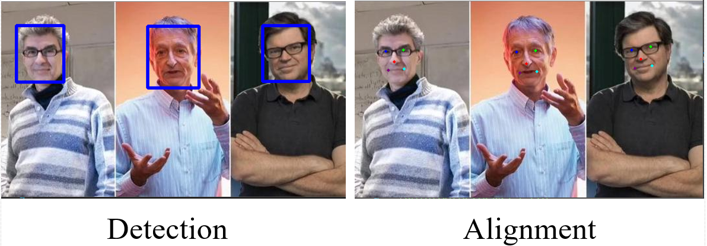
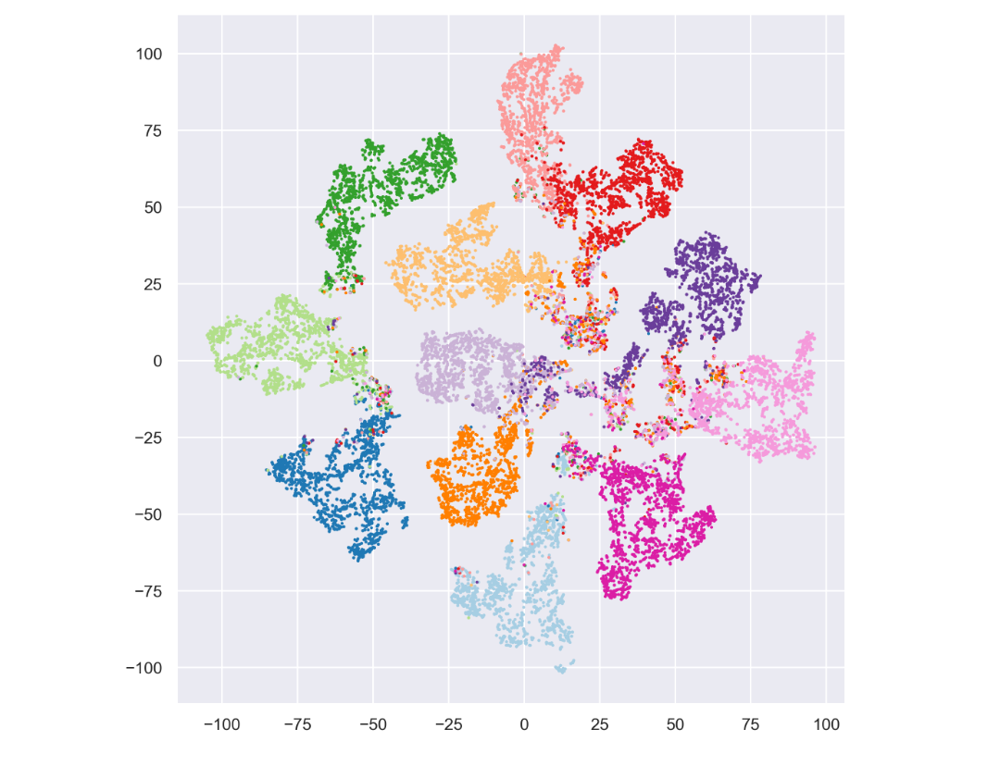

# Analysis Utils

Some useful utilities for CV and DL helpers. 

# File Tree
|    Name           | Date|Usage             |
| --------------    | ----| --------          |
|cali        |2019.07|   Camera calibration based on opencv  both in pythoon and c++ implement  |
|[FIt-SNE](https://github.com/KlugerLab/FIt-SNE)        |2019.10|  tSNE algorithm in c++ implement and has Python API |
| [imutils](https://github.com/jrosebr1/imutils) | 2019.12 | mini-lib based on openCV | 
| DL_template | 2020.03 | A implement of universal DL template based on pytorch. | 
| mujoco-py | 2020.04 |  An adapted version of origin for windows. |

## Demo

- *Demo1*: FaceEngine

- *Demo2*: Calibration

- *Demo3*: FIt-SNE/test_tSNE_pt.py
On windows, call bin/fitsne.exe through. Py script. 

